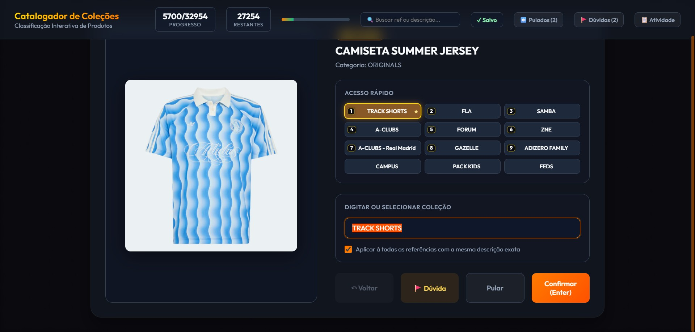
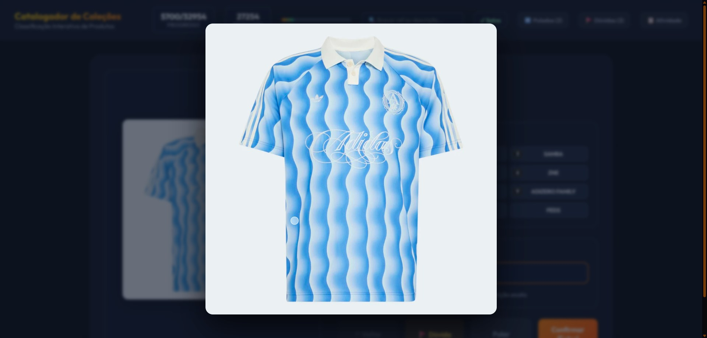

# Fluid Cursor Trail — o efeito do torii.studio

O rastro do cursor na home do [torii.studio](https://torii.studio/) **não é um "trail" comum** (nem partículas, nem canvas 2D com fade). É uma **simulação de fluido 2D rodando na GPU** (Navier-Stokes em tempo real). Eu confirmei isso extraindo os shaders WebGL da própria página — são exatamente os passos de um solver de fluido: `splat`, `advection`, `divergence`, `pressure` (solver de Jacobi, 20 iterações), `curl`/`vorticity`, `dissipation`, mais `bloom`, `dithering` e `shading`.

É o projeto open-source **[WebGL-Fluid-Simulation](https://github.com/PavelDoGreat/WebGL-Fluid-Simulation)** do **Pavel Dobryakov** — **licença MIT**. O torii só ligou `SHADING` + `BLOOM`, deixou o fundo **transparente** sobre o site escuro e tunou a paleta pro rosa/magenta da marca.

## Demos

### Rodáveis (abra e mexa o cursor)

| Demo | Como abrir | O quê |
|---|---|---|
| [`index.html`](index.html) | Abra direto no navegador | Preset **torii** (rosa/magenta) sobre fundo escuro — o efeito puro, do jeito do site. |
| [`testbed/index.html`](testbed/index.html) | Abra direto no navegador | **Bancada com painel ao vivo**: arraste os sliders (dissipação, raio, curl, bloom, blur, véu…) e veja o rastro mudar na hora. É daqui que saem os presets. |

### Aplicado num app real (resultado do `apply_full.py`)

As capturas abaixo mostram o efeito + tema quente (laranja/dourado) **injetados no app Catalogador** via [`apply_full.py`](apply_full.py) — é o mesmo motor de fluido, só com outra paleta e rodando atrás da UI:


*Tela principal — tema quente + fundo de fluido injetados sobre a UI.*


*Zoom de produto, com o fundo escuro e o efeito compondo por trás.*


*Detalhe da toolbar re-tematizada (índigo → laranja/dourado).*

## Como funciona (em 1 parágrafo)

A cada movimento do cursor, o código calcula o deslocamento `(deltaX, deltaY)` e faz um **"splat"**: injeta um borrão gaussiano de **velocidade** (delta × `SPLAT_FORCE`) no campo de velocidade e um borrão de **cor** no campo de tinta (dye), ambos do tamanho `SPLAT_RADIUS`. A cada frame, a GPU resolve o fluido: vorticidade (`CURL`) → divergência → pressão (Jacobi) → subtração do gradiente (mantém incompressível) → **advecção** (a tinta é "empurrada" pelo campo de velocidade) → e tudo desbota um pouco via `DENSITY_DISSIPATION` / `VELOCITY_DISSIPATION`. O resultado é tinta que escorre e some como fumaça, seguindo o cursor.

## Arquivos aqui

**Consumo (o que você normalmente copia pra outro projeto):**

| Arquivo | O quê |
|---|---|
| [`index.html`](index.html) | Versão **vanilla**, copia-e-cola. Abre direto no navegador (carrega o pacote via CDN ESM, sem bundler). |
| [`FluidBackground.jsx`](FluidBackground.jsx) | Componente **React / Next.js** pronto, com SSR-safe + cleanup do contexto WebGL. |

**Bancada de tuning (pra achar os valores antes de levar pra outro projeto):**

| Arquivo | O quê |
|---|---|
| [`testbed/index.html`](testbed/index.html) | Playground com **painel de controle ao vivo** — mexe nos knobs (dissipação, raio, curl, bloom, blur, véu…) e vê o rastro mudar na hora. É daqui que saem os presets. |
| [`testbed-shell.html`](testbed-shell.html) | Variante/shell da bancada. |

**Injeção offline (parafernalha pessoal — injeta o efeito em apps existentes):**

| Arquivo | O quê |
|---|---|
| [`apply_full.py`](apply_full.py) | Script que re-tematiza e injeta o fluido em apps Python/HTML já prontos (parte sempre do backup pristino → idempotente e reversível). Caminhos são pessoais; ajuste antes de reusar. |
| [`fluid_inject_enhanced.txt`](fluid_inject_enhanced.txt) | Template do bloco CSS+JS injetado, com os knobs no topo. |
| `wfe-index.umd.js` / `wfe-index.umd.b64` | Build do [`webgl-fluid-enhanced`](https://github.com/michaelbrusegard/WebGL-Fluid-Enhanced) embutido (o `.b64` é pra injetar sem depender de internet). |

> Créditos completos a todos os autores do efeito em [`CREDITS.md`](CREDITS.md). Licença em [`LICENSE`](LICENSE).

## Setup React/Next

```bash
npm i webgl-fluid
```

Coloque `<FluidBackground />` no **`app/layout.js`** (não numa página). O layout persiste entre navegações → o componente não remonta a cada rota → evita o vazamento de contexto WebGL.

```jsx
import FluidBackground from '@/components/FluidBackground';

export default function RootLayout({ children }) {
  return (
    <html lang="pt-br">
      <body>
        <FluidBackground />
        {children}
      </body>
    </html>
  );
}
```

## Config: defaults reais vs. a versão "torii"

> ⚠️ O README do pacote tem **dois defaults errados**: ele diz `VELOCITY_DISSIPATION: 0.3` e `SPLAT_RADIUS: 0.35`, mas o **código-fonte** usa `0.2` e `0.25`. A tabela abaixo usa os valores reais do fonte.

| Opção | Default (fonte) | Torii-style | Pra que serve |
|---|---|---|---|
| `TRANSPARENT` | `false` | **`true`** | Canvas transparente, compõe sobre seu fundo escuro |
| `BACK_COLOR` | `{r:0,g:0,b:0}` | `{r:6,g:4,b:10}` | Cor de fundo (0-255). Ignorada se `TRANSPARENT` |
| `SHADING` | `true` | `true` | Iluminação volumétrica (ligado no torii) |
| `BLOOM` | `true` | `true` | Brilho (glow) |
| `BLOOM_INTENSITY` | `0.8` | **`0.4`** | Força do glow — mais sutil |
| `BLOOM_THRESHOLD` | `0.6` | **`0.7`** | Só núcleos brilhantes brilham |
| `SUNRAYS` | `true` | **`false`** | God-rays — desligado p/ rastro limpo |
| `DENSITY_DISSIPATION` | `1` | **`3.5`** | Velocidade com que a tinta some (↑ = some mais rápido) |
| `VELOCITY_DISSIPATION` | `0.2` | **`0.5`** | Velocidade com que o movimento assenta |
| `CURL` | `30` | **`8`** | Redemoinho/turbulência (↓ = fita suave) |
| `SPLAT_RADIUS` | `0.25` | **`0.18`** | Espessura do rastro |
| `SPLAT_FORCE` | `6000` | **`4500`** | Força de injeção por movimento |
| `COLORFUL` | `true` | **`false`** | Ciclo automático de cores (off p/ fixar a cor) |
| `SPLAT_COLOR` | `undefined` | `{r:.9,g:.1,b:.5}` | Cor fixa do rastro (canais **0-1 float**) |
| `SIM_RESOLUTION` | `128` | **`96`** | Resolução do grid de velocidade (custo) |
| `DYE_RESOLUTION` | `1024` | **`512`** | Resolução da tinta (nitidez vs. custo de GPU) |
| `PRESSURE_ITERATIONS` | `20` | `20` | Iterações do solver de pressão (principal custo) |
| `TRIGGER` | `'hover'` | `'hover'` | `'hover'` = segue o cursor; `'click'` = só no clique |
| `IMMEDIATE` | `true` | **`false`** | "Explosão" aleatória inicial (off = carrega limpo) |
| `AUTO` | `false` | `false` | Splats automáticos periódicos |

**Quer mais ou menos rastro?** Mexa em `DENSITY_DISSIPATION` (↑ = rastro mais curto), `SPLAT_RADIUS` (espessura) e `CURL` (quantidade de redemoinho).

## Gotchas (os 5 que você vai esbarrar)

1. **Sem teardown → vaza contexto WebGL.** O pacote original roda um `requestAnimationFrame` cujo id nunca é guardado e adiciona listeners anônimos. A cada remontagem cria um novo contexto até o browser reclamar (*"Too many active WebGL contexts"*). **Fix:** montar **uma vez** no layout (não remonta) + soltar o contexto no cleanup com `WEBGL_lose_context` (já feito no componente). Alternativa: usar o fork [`webgl-fluid-enhanced`](https://www.npmjs.com/package/webgl-fluid-enhanced), que tem `start()`/`stop()`.

2. **SSR quebra.** O pacote toca `window`/`document` no load. `'use client'` **não** impede SSR sozinho. **Fix:** import dinâmico **dentro** do `useEffect` (já feito). Pra garantia máxima, renderize via `next/dynamic` com `{ ssr: false }`.

3. **Strict Mode monta 2x em dev** → loop duplicado. **Fix:** flag `cancelled` setada no cleanup e checada após o import resolver (já feito).

4. **Pointer-events.** No pacote original o `mousemove` é escutado **no canvas** — então **não** ponha `pointer-events: none` nele, ou o rastro morre. **Fix (estilo torii):** canvas `position: fixed; inset: 0; z-index: 0`; a camada de conteúdo decorativa com `pointer-events: none` (o cursor atravessa até o canvas) e `pointer-events: auto` só nos links/botões. (O fork *enhanced* escuta no `window`, aí você pode pôr `pointer-events: none` no canvas.)

5. **Cor/transparência fora do esperado.** Default pinta preto sólido (`TRANSPARENT: false`) e cicla todas as cores (`COLORFUL: true`). **Fix:** `TRANSPARENT: true` + `COLORFUL: false` + `SPLAT_COLOR`. Se a cor sair estranha, comente `SPLAT_COLOR` e volte pra `COLORFUL: true` — `SPLAT_COLOR` é a opção que mais varia entre versões.

**Mobile:** o pacote auto-reduz `DYE_RESOLUTION` e **desliga `BLOOM`/`SUNRAYS`** em celulares sem suporte a float-linear — então o glow pode sumir em alguns aparelhos. Use `touch-action: none` no canvas pra ter rastro sem rolar a página.

## Licença

Código da simulação: **MIT**, © 2017 Pavel Dobryakov. Pode usar comercialmente; só mantenha o aviso de copyright/MIT do pacote nos seus arquivos (ele já vem no `node_modules`).
